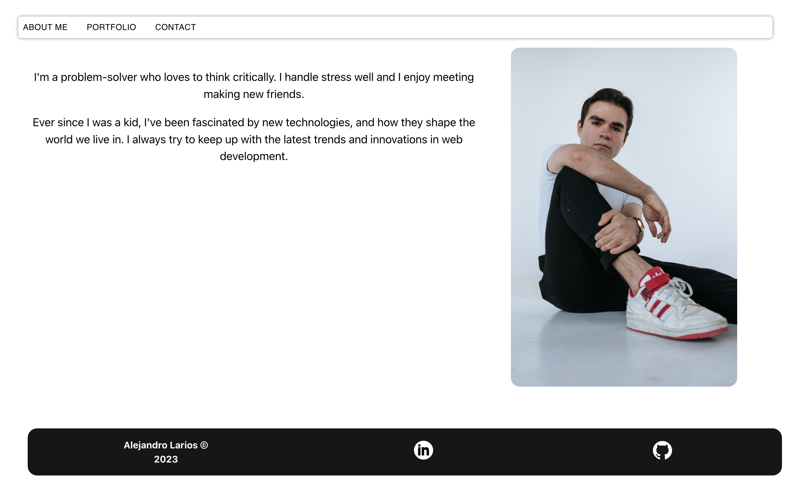
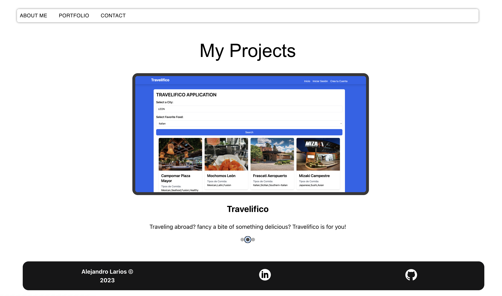
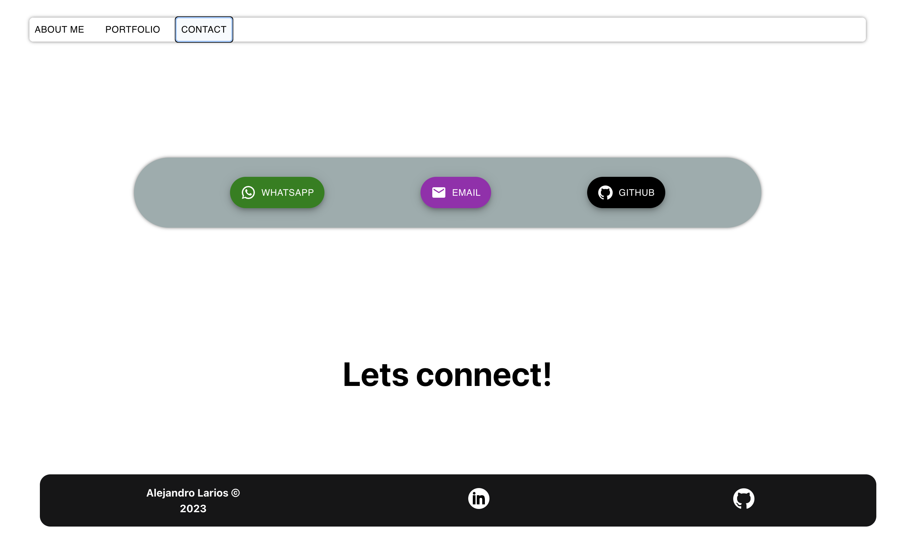

# React Portfolio
by cidherp2

## Table of Contents

*[Description](#description)

*[Installation-instructions](#installation)

*[Usage](#usage)

*[License](#license)

*[Contribution](#contribution)

*[Tests](#test)

*[Questions](#questions)
* [License](#license)

## Description
Abrief portfolio with my most recent proyects created with the latest technologies so i can demostrate what i know and what i'm capable of "
## Installation-instructions
inside the Portfolio React folder, run the command npn run dev if you are a developing the application.
## Usage
it is a simple web page
## License
ISC
## Contribution
There are no contribution guidelines  for this project 
## Tests
there are no test instructions for the project 
## Have any more questions?
You can reach me here
    Git Hub: cidherp2
    email: alexlarios70@hotmail.com

## Screenshots

## License
        Licensed under the ISC license
